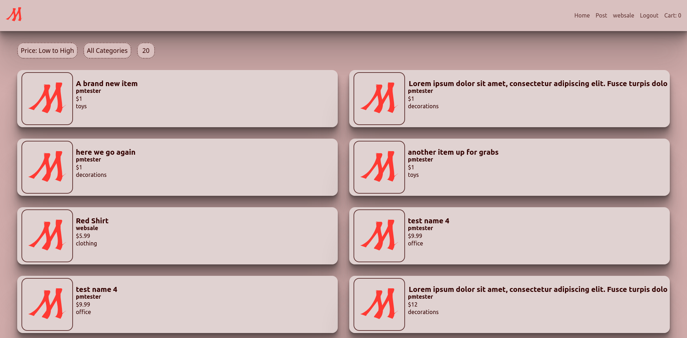
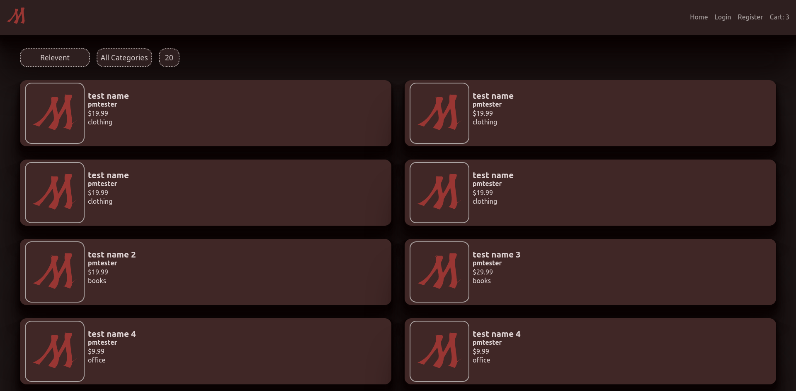
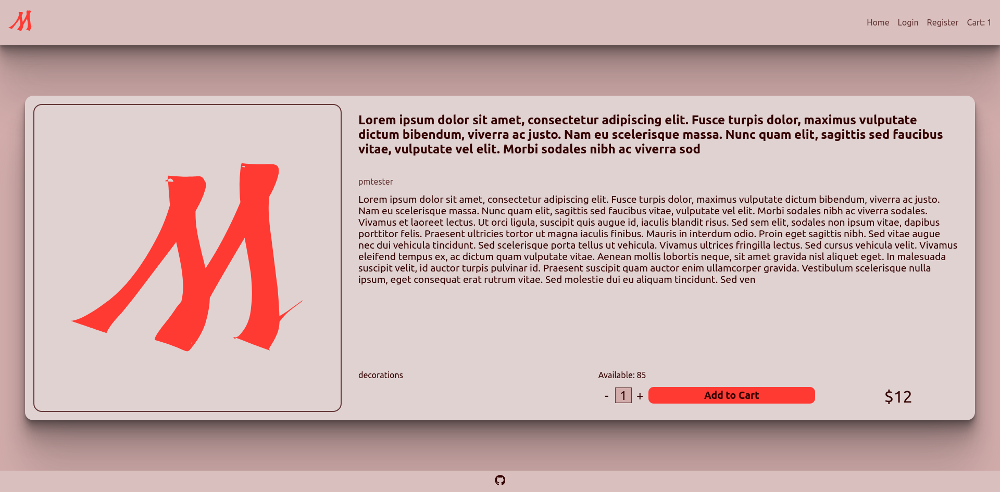
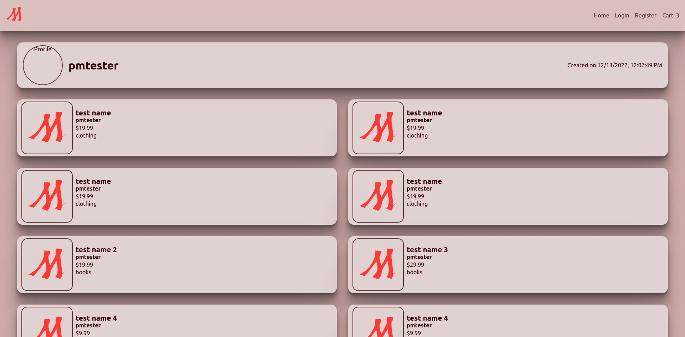
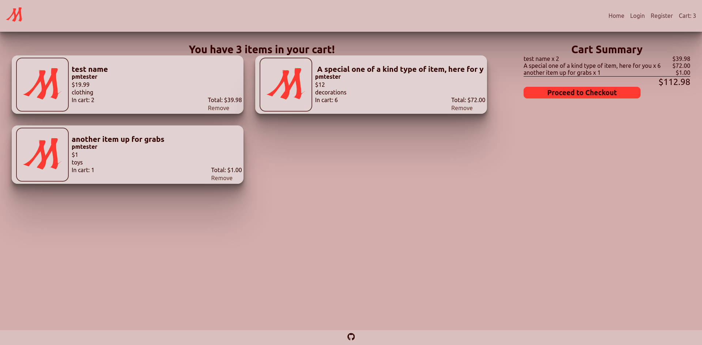

# Marketplace

Frontend for a shopping app

[View Live Here](https://mckgar.github.io/marketplace-frontend)

Backend: https://github.com/mckgar/marketplace-api

Backend not currently hosted, searching for free hosting alternative that isn't a limited trial (server AND db)

## Screenshots

Note: the default image (website logo) is used for all the items because the thought of having (somewhat) unmoderated image submissions on the internet scares me
